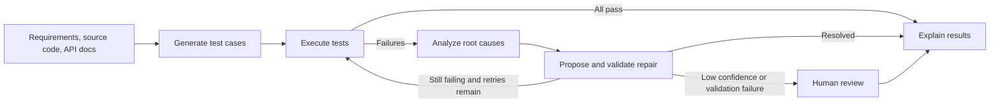

<div align="center">

# AI Test Automation

### An AI-assisted workflow for generating, running, analyzing, and repairing software tests

Turn requirements, source code, and API documentation into executable test suites. When a test fails, the workflow analyzes the failure, attempts a confidence-scored repair, validates it by rerunning the test, and surfaces uncertain changes for human review.

[](https://www.python.org/)
[](https://fastapi.tiangolo.com/)
[](https://www.langchain.com/langgraph)
[](https://playwright.dev/)
[](https://github.com/Mohamedyasser2002/Ai_Test_Automation)

[Watch the project demo](https://youtu.be/9Ua3WoACEdQ?feature=shared)

</div>

---

## Overview

AI Test Automation is a Python application that orchestrates an end-to-end QA workflow with LangGraph. It accepts user stories or acceptance criteria, application source files, optional OpenAPI documentation, and an optional test plan. The system generates test cases, executes them, investigates failures, and produces an explainability report.

The FastAPI dashboard provides a browser-based interface for submitting and inspecting runs. Progress events are broadcast over WebSocket, while run reports and test artifacts are written to local storage.

## Demo

Click the preview to watch the recorded walkthrough:

[](https://youtu.be/9Ua3WoACEdQ?feature=shared)

## Workflow



The workflow supports UI, API, database, and integration test categories. UI tests use Playwright; generated tests are executed in isolated subprocesses, with configurable timeouts and parallel workers. Healing is bounded by a configurable iteration limit (three by default), and repairs below the confidence threshold are sent to the review queue.

## Capabilities

- Generate test scenarios and Python test code from requirements and application context.
- Execute generated test cases and collect status, duration, output, and browser artifacts.
- Classify failures and use an LLM to investigate likely root causes.
- Suggest test-code repairs, compare changes, and validate repairs by rerunning tests.
- Route low-confidence or unverified repairs to a human review queue.
- Stream run progress to connected dashboard clients over WebSocket.
- Produce a report with execution summaries, failure details, healing outcomes, and recommendations.
- Save run reports under `artifacts/reports/` and the most recent run to `data/latest_run.json`.
- Expose application health and Prometheus metrics endpoints.

## Technology

| Area | Technologies |
| --- | --- |
| API and dashboard | Python 3.11+, FastAPI, Uvicorn, HTML/CSS/JavaScript |
| Workflow orchestration | LangGraph, LangChain |
| LLM provider | OpenAI-compatible API; configured for OpenRouter by default |
| Test generation and execution | Pytest, Playwright, Chromium |
| Data validation | Pydantic |
| Observability | Structlog, LangSmith (optional), Prometheus |
| Runtime and tooling | `uv`, Docker Compose, PostgreSQL, Redis |

## Getting Started

### Prerequisites

- Python 3.11 or newer
- [`uv`](https://docs.astral.sh/uv/)
- An API key for the configured OpenAI-compatible LLM provider
- Chromium installed through Playwright for browser-based test execution

### Local setup

```powershell
git clone https://github.com/Mohamedyasser2002/Ai_Test_Automation.git
cd Ai_Test_Automation
uv sync
Copy-Item .env.example .env
```

Set `LLM_API_KEY` in `.env`. The included template uses OpenRouter; configure `LLM_API_BASE` and `LLM_MODEL` for the provider and model you intend to use. Install the browser used by Playwright:

```powershell
uv run playwright install chromium
```

Start the dashboard:

```powershell
uv run ai-test-automation
```

Open the local URL printed by the command (by default, `http://localhost:8080`). If the default port is occupied, the application selects another available port and prints it. To run the sample workflow from the terminal instead of starting the dashboard:

```powershell
uv run python main.py
```

### Docker Compose

Create `.env` from `.env.example`, set `LLM_API_KEY`, then run:

```powershell
docker compose up --build
```

The compose file defines the application, PostgreSQL, Redis, and Prometheus services. The dashboard is mapped to port `8080` and Prometheus to port `9090`. Confirm that the dashboard is reachable in your environment after startup.

## Configuration

Settings can be supplied through `.env` or environment variables. The complete starter template is in [.env.example](.env.example).

| Variable | Purpose |
| --- | --- |
| `LLM_API_KEY` | Required API key for test generation and LLM-assisted analysis |
| `LLM_API_BASE` | OpenAI-compatible API base URL; defaults to OpenRouter |
| `LLM_MODEL` | Provider model identifier |
| `LANGCHAIN_TRACING_V2` | Enable or disable LangSmith tracing |
| `LANGCHAIN_API_KEY` | Optional LangSmith API key |
| `DASHBOARD_HOST` | Dashboard bind address; defaults to `127.0.0.1` |
| `DASHBOARD_PORT` | Preferred dashboard port; defaults to `8080` |
| `APP_MAX_HEALING_ITERATIONS` | Maximum healing iterations; defaults to `3` |
| `APP_CONFIDENCE_THRESHOLD` | Minimum confidence used for automatic healing; defaults to `0.75` |
| `TEST_PARALLEL_WORKERS` | Maximum test execution workers; defaults to `4` |

LangSmith is optional. LLM-backed workflow operations require a valid provider key and a model available to that provider.

## Dashboard and API

The dashboard is available at `/`. FastAPI's interactive API documentation is available at `/docs`.

| Method | Endpoint | Description |
| --- | --- | --- |
| `POST` | `/api/v1/tests/run` | Start a test generation and execution workflow |
| `POST` | `/api/v1/tests/review` | Approve or reject a test in the human review queue |
| `GET` | `/api/v1/runs` | List runs held in the current application process |
| `GET` | `/api/v1/runs/{run_id}` | Get details for a run held in the current process |
| `GET` | `/api/v1/metrics` | Get application configuration and connection metrics as JSON |
| `GET` | `/health` | Check application liveness |
| `GET` | `/metrics` | Read Prometheus-format metrics |
| `WebSocket` | `/ws` | Receive workflow progress and run events |

Example request:

```json
{
	"requirements": "A shopper can add a product to the cart and complete checkout.",
	"source_code": {
		"src/pages/Checkout.tsx": "export default function Checkout() { return <main>Checkout</main>; }"
	},
	"api_docs": "openapi: 3.0.0",
	"test_plan": "Prioritize the checkout critical path."
}
```

Runs are persisted as JSON artifacts, but the live run-history and human-review API currently use in-memory state and are cleared when the application process restarts.

## Development

Run the test suite:

```powershell
uv run pytest
```

The tests are located in `tests/`. Generated run reports and browser artifacts are stored in `artifacts/`, with the latest run summary written to `data/latest_run.json`.

## Repository Layout

```text
.
├── main.py                         # Sample workflow runner
├── frontend/index.html             # Dashboard UI
├── src/
│   ├── api/dashboard.py             # FastAPI routes and WebSocket
│   ├── graph/test_graph.py          # LangGraph workflow
│   ├── models/                      # Request, result, and workflow schemas
│   ├── services/                    # Generation, execution, analysis, repair
│   ├── config.py                    # Application settings
│   └── utils/                       # Logging and AST helpers
├── tests/                           # Automated tests
├── docker/                          # Dockerfile and Prometheus config
├── artifacts/reports/               # Persisted run reports
├── data/                            # Latest run snapshot
├── docker-compose.yml
├── pyproject.toml
└── .env.example
```

## Author

**Mohamed Yasser**
[GitHub](https://github.com/Mohamedyasser2002)

---

<div align="center">

Built as an applied project in AI-assisted software testing and quality engineering.

</div>
