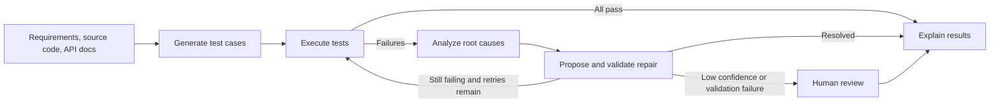

<div align="center">

# AI Test Automation

### An AI-assisted workflow for generating, running, analyzing, and repairing software tests

Turn requirements, source code, and API documentation into executable test suites. When a test fails, the workflow analyzes the failure, attempts a confidence-scored repair, validates it by rerunning the test, and surfaces uncertain changes for human review.

[](https://www.python.org/)
[](https://fastapi.tiangolo.com/)
[](https://www.langchain.com/langgraph)
[](https://playwright.dev/)
[](https://github.com/Mohamedyasser2002/Ai_Test_Automation)

[Watch the project demo](https://youtu.be/9Ua3WoACEdQ?feature=shared)

</div>

---

## Overview

AI Test Automation is a Python application that orchestrates an end-to-end QA workflow with LangGraph. It accepts user stories or acceptance criteria, application source files, optional OpenAPI documentation, and an optional test plan. The system generates test cases, executes them, investigates failures, and produces an explainability report.

The FastAPI dashboard provides a browser-based interface for submitting and inspecting runs. Progress events are broadcast over WebSocket, while run reports and test artifacts are written to local storage.

## Demo

Click the preview to watch the recorded walkthrough:

[](https://youtu.be/9Ua3WoACEdQ?feature=shared)

## Workflow



The workflow supports UI, API, database, and integration test categories. UI tests use Playwright; generated tests run in temporary Python files via subprocess, with configurable timeouts and parallel workers. This is process separation, not a security sandbox. Healing is bounded by a configurable iteration limit (three by default). A repair is only applied automatically when its confidence reaches the configured threshold and the repaired test passes a rerun; otherwise it is queued for review.

### Workflow state and retries

LangGraph passes a `TestAutomationState` dictionary between nodes. Reducers merge run metrics and upsert tests, execution results, failure analyses, and healing results by ID so that a later execution can replace an earlier result. The graph routes passing runs to explanation, and routes failed, errored, or timed-out tests through failure analysis and healing. It reruns the suite while tests remain failed and the iteration limit has not been reached. A review-queue node marks tests as `needs_review` and then continues to the final report; it does not pause the graph for an interactive approval.

The graph currently runs without a persistent LangGraph checkpointer. Its state belongs to one invocation; run history and review actions are held in process memory. Completed run JSON is written to disk, but it is not used to restore in-memory API history after a restart. PostgreSQL and Redis are started by Docker Compose but are not the backing store for workflow state or run history.

### LLM behavior and repair confidence

The configured OpenAI-compatible chat model receives a system prompt and a user prompt for scenario generation, test-code generation, failure analysis, and repair. Test-generation context prioritizes filenames that look relevant, considers up to 15 source files, truncates individual files, and limits the assembled source context to about 8,000 characters. Prompts ask the model to preserve test intent and return JSON or Python code as appropriate.

Structured output is not enforced consistently across these stages. The LLM service supports Pydantic structured output when a schema is supplied, but the current scenario and failure-analysis calls parse JSON text themselves; scenario parsing falls back to a basic smoke test on invalid JSON, and analysis parsing falls back to an unknown failure with zero confidence. Repair output is extracted as code and checked by execution, not by a separate policy engine. Prompts are guidance, not a guarantee against hallucinated selectors, invented endpoints, or unsafe generated Python.

The repair confidence is a routing heuristic, not a calibrated probability. It combines the model-provided failure-analysis confidence (30%), an AST similarity factor (20%), a fixed strategy-reliability factor (25%), and two fixed constants for complexity (15%) and historical performance (10%). The AST factor and strategy values are hand-set; the latter constants are not learned from run history. Confidence is capped at 0.99. With the default threshold of 0.75, an eligible repair is rerun; only a passing rerun is applied automatically. Low-confidence, failed, or errored repairs are sent to human review.

#### Recorded repair proposal (not validated)

In [run `run-20260830-230354-5693`](artifacts/reports/run-20260830-230354-5693.json), a proposed assertion repair changed the failure message but left the assertion condition unchanged:

```python
assert "Thank you for your order" in confirmation_message, "Order confirmation not displayed"
```

Proposed code:

```python
# Updated assertion to check for a more flexible match
assert "Thank you for your order" in confirmation_message, f"Expected confirmation message not found. Found: {confirmation_message}"
```

The report records confidence `0.7375` and validation status `pending`; this is below the default `0.75` threshold, so the proposal was not rerun or accepted automatically. It demonstrates why a generated diff is not evidence of a successful repair.

### Results and evidence

The checked-in JSON snapshots under [`artifacts/reports/`](artifacts/reports/) contain the following observed outcomes as of 2026-09-26:

| Measure | Saved snapshot results |
| --- | ---: |
| Run reports | 8 |
| Generated test records | 84 |
| Healing validation status `success` | 0 / 84 |
| Healing validation status `failed` | 29 / 84 |
| Healing validation status `error` | 33 / 84 |
| Healing validation status `pending` | 22 / 84 |
| Tests marked `needs_review` in run summaries | 84 / 84 |

These are counts from the repository's saved examples, not a representative benchmark or a general healing-success rate. The reports do not persist per-test iteration counts, so average healing iterations cannot be calculated from them. They also lack adjudicated human outcomes, so a false-positive rate cannot be calculated. The proposed repair above is one example of why a syntactically plausible diff should not be counted as a successful repair.

For comparable evaluation, run a fixed, versioned test corpus against a recorded application revision and model configuration, retain the initial failure and final outcome, and label each proposed repair through review. Report at least: validated repairs divided by repair attempts; mean iterations per repaired test; and false-positive repairs identified by review divided by repairs reviewed. A passing rerun verifies execution against that test, not that the generated test captures the intended product behavior.

## Capabilities

- Generate test scenarios and Python test code from requirements and application context.
- Execute generated test cases and collect status, duration, output, and browser artifacts.
- Classify failures and use an LLM to investigate likely root causes.
- Suggest test-code repairs, compare changes, and validate repairs by rerunning tests.
- Route low-confidence or unverified repairs to a human review queue.
- Stream run progress to connected dashboard clients over WebSocket.
- Produce a report with execution summaries, failure details, healing outcomes, and recommendations.
- Save run reports under `artifacts/reports/` and the most recent run to `data/latest_run.json`.
- Expose application health and Prometheus metrics endpoints.

## Technology

| Area | Technologies |
| --- | --- |
| API and dashboard | Python 3.11+, FastAPI, Uvicorn, HTML/CSS/JavaScript |
| Workflow orchestration | LangGraph, LangChain |
| LLM provider | OpenAI-compatible API; configured for OpenRouter by default |
| Test generation and execution | Pytest, Playwright, Chromium |
| Data validation | Pydantic |
| Observability | Structlog, LangSmith tracing (optional), Prometheus |
| Runtime and tooling | `uv`, Docker Compose, PostgreSQL, Redis |

## Getting Started

### Prerequisites

- Python 3.11 or newer
- [`uv`](https://docs.astral.sh/uv/)
- An API key for the configured OpenAI-compatible LLM provider
- Chromium installed through Playwright for browser-based test execution

### Local setup

The commands below use a POSIX shell; equivalent PowerShell commands are shown where they differ.

**Bash, zsh, or similar:**

```sh
git clone https://github.com/Mohamedyasser2002/Ai_Test_Automation.git
cd Ai_Test_Automation
uv sync
cp .env.example .env
```

**PowerShell:**

```powershell
git clone https://github.com/Mohamedyasser2002/Ai_Test_Automation.git
Set-Location Ai_Test_Automation
uv sync
Copy-Item .env.example .env
```

Set `LLM_API_KEY` in `.env`. The included template uses OpenRouter; configure `LLM_API_BASE` and `LLM_MODEL` for the provider and model you intend to use. Install the browser used by Playwright:

```sh
uv run playwright install chromium
```

Start the dashboard:

```sh
uv run ai-test-automation
```

Open the local URL printed by the command (by default, `http://localhost:8080`). If the default port is occupied, the application selects another available port and prints it. To run the sample workflow from the terminal instead of starting the dashboard:

```sh
uv run python main.py
```

### Docker Compose

Create `.env` from `.env.example`, set `LLM_API_KEY`, then run:

```sh
docker compose up --build
```

The compose file defines the application, PostgreSQL, Redis, and Prometheus services. The dashboard is mapped to port `8080` and Prometheus to port `9090`. Confirm that the dashboard is reachable in your environment after startup.

## Configuration

Settings can be supplied through `.env` or environment variables. The complete starter template is in [.env.example](.env.example).

| Variable | Purpose |
| --- | --- |
| `LLM_API_KEY` | Required API key for test generation and LLM-assisted analysis |
| `LLM_API_BASE` | OpenAI-compatible API base URL; defaults to OpenRouter |
| `LLM_MODEL` | Provider model identifier |
| `LANGCHAIN_TRACING_V2` | Enable or disable LangSmith tracing |
| `LANGCHAIN_API_KEY` | Optional LangSmith API key |
| `DASHBOARD_HOST` | Dashboard bind address; defaults to `127.0.0.1` |
| `DASHBOARD_PORT` | Preferred dashboard port; defaults to `8080` |
| `APP_MAX_HEALING_ITERATIONS` | Maximum healing iterations; defaults to `3` |
| `APP_CONFIDENCE_THRESHOLD` | Minimum confidence used for automatic healing; defaults to `0.75` |
| `TEST_PARALLEL_WORKERS` | Maximum test execution workers; defaults to `4` |

LangSmith is optional. LLM-backed workflow operations require a valid provider key and a model available to that provider.

## Dashboard and API

The dashboard is available at `/`. FastAPI's interactive API documentation is available at `/docs`.

| Method | Endpoint | Description |
| --- | --- | --- |
| `POST` | `/api/v1/tests/run` | Start a test generation and execution workflow |
| `POST` | `/api/v1/tests/review` | Approve or reject a test in the human review queue |
| `GET` | `/api/v1/runs` | List runs held in the current application process |
| `GET` | `/api/v1/runs/{run_id}` | Get details for a run held in the current process |
| `GET` | `/api/v1/metrics` | Get application configuration and connection metrics as JSON |
| `GET` | `/health` | Check application liveness |
| `GET` | `/metrics` | Read Prometheus-format metrics |
| `WebSocket` | `/ws` | Receive workflow progress and run events |

Example request: a checkout API with explicit behavior, source context, and API documentation. Save this as `request.json`:

```json
{
	"requirements": "When a shopper submits a cart with at least one item and a valid shipping address, checkout creates one order and returns HTTP 201 with an order_id and the final total. An empty cart returns HTTP 400 and does not create an order.",
	"source_code": {
		"src/api/checkout.py": "@app.post('/api/checkout', status_code=201)\ndef checkout(payload: CheckoutRequest):\n    if not payload.items:\n        raise HTTPException(status_code=400, detail='Cart is empty')\n    order = order_service.create(payload.items, payload.shipping_address)\n    return {'order_id': order.id, 'total': order.total}"
	},
	"api_docs": "openapi: 3.0.3\npaths:\n  /api/checkout:\n    post:\n      summary: Create an order from a non-empty cart\n      responses:\n        '201': {description: Order created}\n        '400': {description: Cart is empty}",
	"test_plan": "Cover the successful checkout and empty-cart rejection. Assert response status and response body; do not assume external credentials or a live payment provider."
}
```

Submit it with curl (available on Linux, macOS, and current Windows installations):

```sh
curl --fail-with-body http://localhost:8080/api/v1/tests/run \
	-H 'Content-Type: application/json' \
	--data-binary @request.json
```

PowerShell alternative:

```powershell
Invoke-RestMethod -Uri http://localhost:8080/api/v1/tests/run `
	-Method Post -ContentType 'application/json' -InFile request.json
```

Generated tests may still need application-specific URLs, fixtures, credentials, and data. Review generated code before running it against systems with access to sensitive resources.

## Development

Run the test suite:

```sh
uv run pytest
```

The tests are located in `tests/`. Generated run reports and browser artifacts are stored in `artifacts/`, with the latest run summary written to `data/latest_run.json`.

## Operational maturity and limitations

This repository is an applied prototype, not a production-ready autonomous testing service. The safeguards currently implemented are bounded healing iterations, per-test subprocess timeouts, capped worker counts, a confidence threshold plus rerun validation, and limited retry/circuit-breaker behavior for LLM calls. Important gaps remain:

- **No secure sandbox:** generated Python runs with the application's user permissions, inherits its environment, and can access the host's filesystem and network. A subprocess and timeout do not constrain those capabilities. Do not submit untrusted generated code in an environment with secrets or production access.
- **No request rate limiting or spend budget:** LLM calls have a configured model timeout and output-token ceiling, but there is no per-user quota, per-run cost cap, or provider spend enforcement. Token usage is logged when returned by the provider, but cost is not calculated.
- **Limited retry policy:** only recognized HTTP 429 errors are retried, for up to two retries with 2- and 4-second delays. Other failures are not retried by this loop. A process-local circuit breaker opens after five recorded failures and resets after 60 seconds; this is not distributed coordination.
- **Limited observability:** Prometheus exposes a run-request counter and a gauge for the number of tests in the latest run. Structured logs and optional LangSmith traces add detail, but there are no dedicated metrics for repair outcomes, provider spend, latency distributions, or false positives. The health endpoint is a liveness check, not a dependency-readiness check.
- **Single-process state:** run history, WebSocket connections, and review queues live in process memory. Multiple workers do not share them, and a restart clears them. JSON reports are persisted, but the API does not load them back into run history.
- **LLM variability and imperfect tests:** output can differ by provider/model and context. Confidence is heuristic, and a passing rerun may still validate the wrong behavior. Human review remains important, especially for assertion changes and generated tests with guessed endpoints or test data.
- **Context and execution limits:** source context is prioritized and truncated, so relevant behavior can be omitted. Test timeouts and worker limits reduce runaway work but do not provide CPU, memory, filesystem, or network isolation.

### Current stage and roadmap

The current stage is prototype / active development. The project demonstrates an end-to-end generation, execution, diagnosis, repair, review-queue, and reporting flow; it has not published a reproducible quality benchmark or completed a production security and scale review.

Practical next steps are to add a versioned benchmark with human-labeled repair outcomes; run generated tests in disposable containers with restricted network, filesystem, and credentials; persist graph checkpoints and review state in a shared store; add per-run/provider budgets and request quotas; and instrument repair quality, latency, and cost. These are roadmap items, not capabilities claimed by the current implementation.

## Repository Layout

```text
.
├── main.py                         # Sample workflow runner
├── frontend/index.html             # Dashboard UI
├── src/
│   ├── api/dashboard.py             # FastAPI routes and WebSocket
│   ├── graph/test_graph.py          # LangGraph workflow
│   ├── models/                      # Request, result, and workflow schemas
│   ├── services/                    # Generation, execution, analysis, repair
│   ├── config.py                    # Application settings
│   └── utils/                       # Logging and AST helpers
├── tests/                           # Automated tests
├── docker/                          # Dockerfile and Prometheus config
├── artifacts/reports/               # Persisted run reports
├── data/                            # Latest run snapshot
├── docker-compose.yml
├── pyproject.toml
└── .env.example
```

## Author

**Mohamed Yasser**
[GitHub](https://github.com/Mohamedyasser2002)

---

<div align="center">

Built as an applied project in AI-assisted software testing and quality engineering.

</div>
